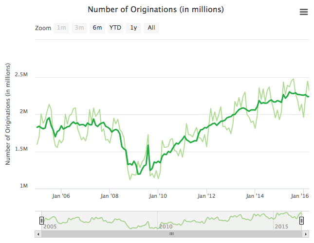

# CFPB Chart Builder [](https://travis-ci.org/cfpb/cfpb-chart-builder) [](https://coveralls.io/github/cfpb/cfpb-chart-builder?branch=master) [](https://saucelabs.com/u/cct-sauce)

Charts for the [Consumer Financial Protection Bureau](https://cfpb.github.io/).

## Demo

https://cfpb.github.io/cfpb-chart-builder/

## Installation

Add a `div` with a class of `cfpb-chart` and the following data attributes to your page:

```
<div class="cfpb-chart"
     data-chart-type="line"
     data-chart-title="Number of Originations (in millions)"
     data-chart-y-axis-label="Volume of Originations (in billons)"
     data-chart-description="Auto loan originations decreased in 2016."
     data-chart-color="green"
     data-chart-metadata="Number of Loans"
     data-chart-source="consumer-credit-trends/auto-loans.csv">
     Auto loan originations decreased in 2016.
</div>
```

Add the library to your page:

```
<script type="text/javascript" src="dist/cfpb-chart-builder.min.js"></script>
```

It'll generate a chart for you:



You can also manually initialize a chart by providing a target element.
Install the library with `npm install cfpb-chart-builder` and then:

```js
const ccb = require( 'cfpb-chart-builder' );

const chart = ccb.createChart({
  el: document.getElementById('my-chart-div'),
  source: 'http://mywebsite.com/api/data.json',
  type: 'line',
  color: 'green'
});

// Charts can be updated and redrawn
chart.update({
  source: 'http://mywebsite.com/api/some-other-data.json',
});

```

## API

### `createChart( options )`

Create a CFPB chart.
Config options can be passed as an argument to `createChart` or as a data attribute on
an element with a class of `cfpb-chart` (see above).

**options.el**: `Element`

Required. Reference to the DOM element in which to render the chart.

**options.type**: `String`

Required. Type of chart to render. Options: `line`, `line-comparison`, `bar` or `tile_map`.

**options.source**: `String`

Required. Location of data (JSON) to download and add to chart series.
Can be relative or absolute URL.
If relative, the value of `window.CFPB_CHART_DATA_SOURCE_BASE` will be prepended to it.

Multiple data sources can be provided by separating them with semicolons.
E.g. `mortgage/national.json;mortgage/nyc.json`.

**options.title**: `String`

Optional. Title of the chart.

**options.color**: `String`

Optional. Chart's color scheme. Options: `blue`, `green`, `teal`, `navy`.

**options.metadata**: `String|Object`

Optional. Arbitrary metadata for your chart.
For example, `bar` charts currently require a group key (e.g. `Number of Loans`) to filter data.

**options.tooltipFormatter**: `Function`

Optional. Function that returns HTML to format the chart's tooltip.
See Highcharts' [tooltip.formatter](http://api.highcharts.com/highmaps/tooltip.formatter).

**options.pointDescriptionFormatter**: `Function`

Optional. Formatter function to use instead of the default for point descriptions.
See Highcharts' [accessibility.pointDescriptionFormatter](http://api.highcharts.com/highmaps/accessibility.pointDescriptionFormatter).

**options.seriesDescriptionFormatter**: `Function`

Optional. Formatter function to use instead of the default for series descriptions.
See Highcharts' [accessibility.seriesDescriptionFormatter](http://api.highcharts.com/highmaps/accessibility.seriesDescriptionFormatter).

**options.screenReaderSectionFormatter**: `Function`

Optional. A formatter function to create the HTML contents of the hidden screen
reader information region. See Highcharts' [accessibility.screenReaderSectionFormatter](http://api.highcharts.com/highmaps/accessibility.screenReaderSectionFormatter).

### `chart.update( options )`

Update a CFPB chart.
Provide any of the above options and the chart will be redrawn with those new settings.

## Contributing

We welcome your feedback and contributions. See the
[contribution guidelines](https://github.com/cfpb/open-source-project-template/blob/master/CONTRIBUTING.md)
for more details.

### Install locally

1. Install [Node.js 8](http://nodejs.org) however you'd like.
2. Install [Gulp](http://gulpjs.com): `npm install -g gulp`
3. Install the dependencies and compile the project with: `./setup.sh`

  __NOTE:__ To re-install and rebuild all the site’s assets run
  `./setup.sh` again. See the [usage](#usage) section on updating all the
  project dependencies.

### Development usage

Each time you fetch from the upstream repository (this repo), run `./setup.sh`.
This setup script will remove and re-install the project dependencies and
rebuild the site's JavaScript and CSS assets.

To watch for changes in the source code and automatically update the running site,
open a terminal and run:

```bash
gulp watch
```

## Testing

`npm test` will run unit and browser tests.

Sauce Labs is used to test the charts in IE 8 through 10.
An [Open Sauce](https://saucelabs.com/open-source) account has been created for this repo.
Its credentials can be found at https://GHE/gist/contolini/504ea71f6a19c74090c7a150aff60421.
Add the credentials locally by doing:

1. `cp test/config.json.example test/config.json`
1. Add valid Sauce Labs credentials to `test/config.json` (see above gist).

The browser tests will take several minutes to run.
The test script simply loads `http://localhost:8089/test` in IE VMs and reports any `window` errors.

## Getting help

Use the issue tracker to follow the development conversation.
If you find a bug not listed in the issue tracker, please file a bug report.

## Getting involved

We welcome your feedback and contributions. See the
[contribution guidelines](https://github.com/cfpb/open-source-project-template/blob/master/CONTRIBUTING.md)
for more details.

Additionally, you may want to consider
[contributing to the Capital Framework](https://cfpb.github.io/capital-framework/contributing/),
which is the front-end pattern library used in this project.

----

## Open source licensing info
1. [TERMS](TERMS.md)
2. [LICENSE](LICENSE)
3. [CFPB Source Code Policy](https://github.com/cfpb/source-code-policy/)
